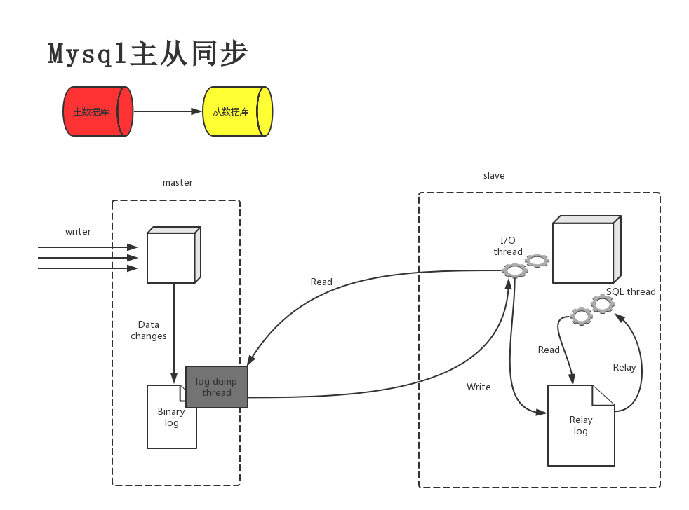

 #   Mysql

##   mysql安装

1. 安装之前的准备环境

   ``` bash
   $ yum clean all
   $ yum makecache
   $ systemctl stop firewalld
   $ setenforce 0
   ```

2. 下载需要mysql的安装包

   ``` bash
   $ wget http://dev.mysql.com/get/mysql57-community-release-el7-10.noarch.rpm
   ```

3. 安装mysql服务

   ``` bash
   $ yum -y install mysql57-community-release-el7-10.noarch.rpm
   $ yum install mysql-community-server
   ```

4. 启动和查看mysql服务状态

   ``` bash
   $ systemctl start mysqld
   $ systemctl status mysqld
      Active: active (running)
   ```

5. 查看mysql的版本号

   ``` bash
   $ grep 'temporary password' /var/log/mysqld.log
   $ mysql -uroot -p
      Server version: 5.7.24
   ```

6. 修改mysql的登录密码

   ```bash
   $ mysql> show databases;
        ERROR 1820 (HY000): You must reset your password using ALTER USER statement  before   executing this statement.
   $ mysql> alter user 'root'@'localhost' identified by '自己需要修改新的密码';
      Query OK, 0 rows affected (0.00 sec)
   $ systemctl restart mysqld
   $ mysql> show databases;
      +--------------------+
      | Database           |
      +--------------------+
      | information_schema |
      | mysql              |
      | performance_schema |
      | sys                |
      +--------------------+
      4 rows in set (0.00 sec)
   ```


## Mysql 配置

InnoDB 用来高速缓冲数据和索引内存缓冲大小

``` bash
$ innodb_buffer_pool_size = 128M
```

使用join查询语句的大小

``` bash
$ join_buffer_size = 128M
```


通过增加该值的大小可以提高查询中使用“group by”和“order by”的性能

``` bash
$ sort_buffer_size = 2M
```

MySQL的随机读缓冲区大小

``` bash
$ read_rnd_buffer_size = 2M
```

数据文件存放的目录

``` bash
$ datadir=/var/lib/mysql
```

为MySQL客户端程序和服务器之间的本地通讯指定一个套接字文件

``` bash
$ socket=/var/lib/mysql/mysql.sock  
```

错误日志文件的路径

``` bash
$ log-error=/var/log/mysqld.log
```

pid文件所在目录

``` bash
$ pid-file=/var/run/mysqld/mysqld.pid
```

## Mysql主从同步

   ### Mysql主从同步的原理

​       mysql主从复制需要三个线程，master（binlog dump thread）、slave（I/O thread 、SQL thread)。

​     1.1. master
​         binlog dump线程：当主库中有数据更新时，那么主库就会根据按照设置的binlog格式，将此次更新的事件类型写入到主库的binlog文件中，此时主库会创建log dump线程通知slave有数据更新，当I/O线程请求日志内容时，会将此时的binlog名称和当前更新的位置同时传给slave的I/O线程。
​     2.2. slave
​         I/O线程：该线程会连接到master，向log dump线程请求一份指定binlog文件位置的副本，并将请求回来的binlog存到本地的relay log中，relay log和binlog日志一样也是记录了数据更新的事件，它也是按照递增后缀名的方式，产生多个relay log（ host_name-relay-bin.000001）文件，slave会使用一个index文件（ host_name-relay-bin.index）来追踪当前正在使用的relay log文件。
​        SQL线程：该线程检测到relay log有更新后，会读取并在本地做redo操作，将发生在主库的事件在本地重新执行一遍，来保证主从数据同步。此外，如果一个relay log文件中的全部事件都执行完毕，那么SQL线程会自动将该relay log 文件删除掉。

### Mysql主从同步流程图



#### Master服务详细配置过程

1. 修改配置文件

   ```bash
   $ vim /etc/my.cnf
     [mysqld]
     # 开启二进制日志
       log-bin = mysql-bin
     # 设置唯一的server-id
       server-id = 1
     # 不同步的数据库
       binlog-ignore-db = mysql
       binlog-ignore-db = information_schema
   ```

2. 重启mysql服务，并且创建主从同步的用户

   ```bash
   $ systemctl restart mysqld
   $ mysql -uroot -p
     mysql> grant replication slave on *.* to dbcp@'%' identified by 'MyNewPass4!';
     Query OK, 0 rows affected, 1 warning (0.03 sec)
   $ mysql> flush privileges;
     Query OK, 0 rows affected (0.00 sec)
   ```

3. 查看Master状态，记录二进制文件名和位置

   ```bash
   $ mysql> SHOW MASTER STATUS;
   +------------------+----------+--------------+--------------------------+-------------------+
   | File             | Position | Binlog_Do_DB | Binlog_Ignore_DB         | Executed_Gtid_Set |
   +------------------+----------+--------------+--------------------------+-------------------+
   | mysql-bin.000001 |     1048 |              | mysql,information_schema |                   |
   +------------------+----------+--------------+--------------------------+-------------------+
   1 row in set (0.00 sec)
   ```

​        File  :  mysql-bin.000001      Position  :  1048

#### slave服务详细配置过程

1.  修改配置文件

   ```bash
   $ vim /etc/my.cnf
     [mysqld]
     # 设置唯一的server-id
       server-id = 2
   ```

2. 重启mysql服务，并且执行同步的SQL语句

   ```bash
   $ systemctl restart mysqld
   $ CHANGE MASTER TO MASTER_HOST='192.168.184.140', MASTER_USER='dbcp',    MASTER_PASSWORD='MyNewPass4!', MASTER_LOG_FILE='mysql-     bin.000001',MASTER_LOG_POS=1048;
   ```

3. 启动slave同步进程

   ```bash
   $ mysql> start slave;
     Query OK, 0 rows affected (0.04 sec)
   ```

4. 查看主从同步状态

   ```bash
   $ mysql> show slave status\G;
   *************************** 1. row ***************************
                  Slave_IO_State: Waiting for master to send event
                     Master_Host: 192.168.184.140
                     Master_User: dbcp
                     Master_Port: 3306
                   Connect_Retry: 60
                 Master_Log_File: mysql-bin.000001
             Read_Master_Log_Pos: 1048
                  Relay_Log_File: yaoshi-test2-relay-bin.000002
                   Relay_Log_Pos: 320
           Relay_Master_Log_File: mysql-bin.000001
                Slave_IO_Running: Yes
               Slave_SQL_Running: Yes
                 Replicate_Do_DB: 
             Replicate_Ignore_DB: 
              Replicate_Do_Table: 
          Replicate_Ignore_Table: 
         Replicate_Wild_Do_Table: 
     Replicate_Wild_Ignore_Table: 
                      Last_Errno: 0
                      Last_Error: 
                    Skip_Counter: 0
             Exec_Master_Log_Pos: 1048
                 Relay_Log_Space: 534
                 Until_Condition: None
                  Until_Log_File: 
                   Until_Log_Pos: 0
              Master_SSL_Allowed: No
              Master_SSL_CA_File: 
              Master_SSL_CA_Path: 
                 Master_SSL_Cert: 
               Master_SSL_Cipher: 
                  Master_SSL_Key: 
           Seconds_Behind_Master: 0
   Master_SSL_Verify_Server_Cert: No
                   Last_IO_Errno: 0
                   Last_IO_Error: 
                  Last_SQL_Errno: 0
                  Last_SQL_Error: 
     Replicate_Ignore_Server_Ids: 
                Master_Server_Id: 1
                     Master_UUID: a47cc4e9-03fe-11e9-b647-000c29cf5d28
                Master_Info_File: /var/lib/mysql/master.info
                       SQL_Delay: 0
             SQL_Remaining_Delay: NULL
         Slave_SQL_Running_State: Slave has read all relay log; waiting for more updates
              Master_Retry_Count: 86400
                     Master_Bind: 
         Last_IO_Error_Timestamp: 
        Last_SQL_Error_Timestamp: 
                  Master_SSL_Crl: 
              Master_SSL_Crlpath: 
              Retrieved_Gtid_Set: 
               Executed_Gtid_Set: 
                   Auto_Position: 0
            Replicate_Rewrite_DB: 
                    Channel_Name: 
              Master_TLS_Version: 
   1 row in set (0.00 sec)
   ```

* 其中Slave_IO_Running: Yes  和  Slave_SQL_Running: Yes  都为YES代表同步成功。